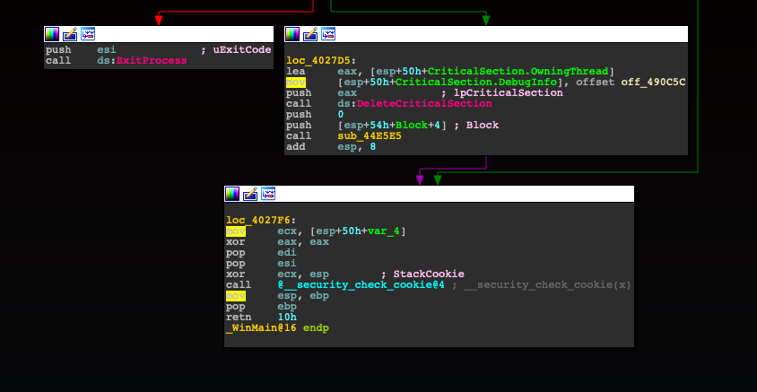

# IDA PRO Theme - Pi Hunter

A theme inspired by the Raspberry Pi.




## Installation

For versions greater than 7.3:

Create a new theme directory, MACOSX and 'Nix:

```
mkdir -p ~/.idapro/themes/ida-theme-pihunter
```

Windows:

```
%APPDATA%\Hex-Rays\IDA Pro\themes\ida-theme-pihunter
```

Copy the theme.css file from this repository into it.

For versions less than 7.3:

1. Open the Options menu
2. Select Colors
3. Select Import

Install the `id-theme-pithunter.clr` file.


